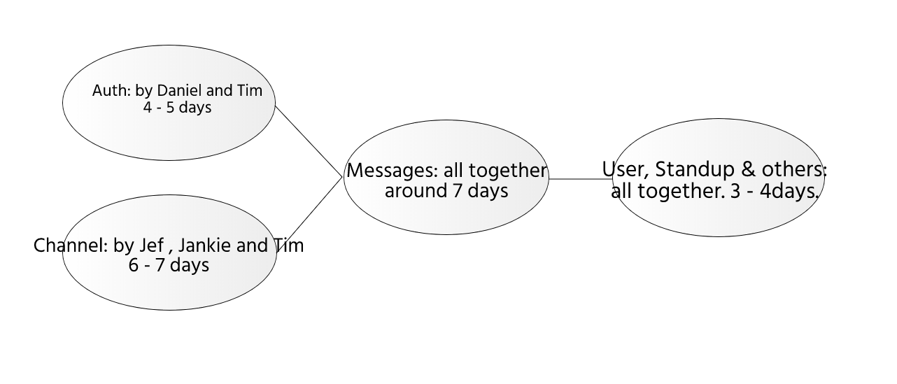

Plan
======
**About Iteration 2**

All the function are divided into 6 parts, "auth", "channel", "user", "standup", "others", "messages"

**Auth**

These part of function contains the most basic function for the website--login.
When the customer need to use the app , they will have to login or register.
We need a web-based database to stored all the info of users to make sure they could
login in again after the first use. These functions are the most important functions 
because all the following functinon need to check to correctness of the token and
auth gives user the token. This part should be not hard to complete so it may takes 4-5 days to complete the
auth functions by Daniel and Tim.
The register should be finished first then comes with the login and logout.

**Channel**

The channel is based on the implementation of Auth part. This part is the second important part 
because this is the basic way to set communication with different users. And it contaions a 
lot of functions. Jef , Jankie and Tim are contributing to this part for 6-7 days to finish.
The channel_create should be created first then comes the join, invite ,leave and then the list function.
The message function would be finished last. It's not so hard though.

**messages**

Here comes the message part, the third important functions, it includes all the manipulation to the messages
within a channel, and it should be the hardest ones througgh all the functions, they are complicated, confusing and tricky.
We should be very careful to each of them, so all of us will spend 7 days on it, trying our best to do this. Good luck with it.

**user**

This part seems easy and actually it easy. All we need to know is how to save the changes to the database.
Functions in this probably using the same path with the function in part Auth , just need to add a change 
function to let the user change their personal profile. Jef and Daniel will be working on it.

**Standup and others**

Not so hard. Using the same path from previous function, so it wont take too long.
Standup need to take message and send to all users, so it can use the function in the "message" 
part, Jef and Jankie will be working on it, and other would assit if needed. 
Takes about 3-4 day...

